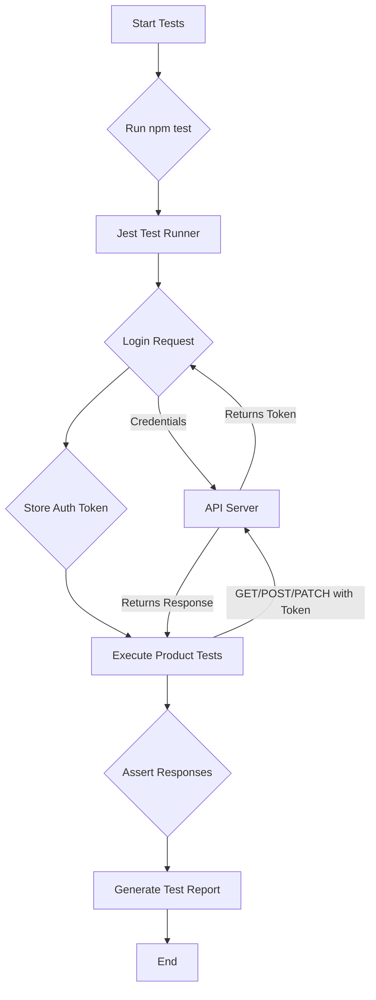

# TestSuite E2E Login & Products API

A comprehensive End-to-End (E2E) testing suite for a sample Login and Products API. This project is designed to showcase a full range of QA and testing skills, from manual test case design to automated API testing.

---

### Attractive Badges


---

## 📋 Table of Contents
- [✨ Features](#-features)
- [💻 Tech Stack](#-tech-stack)
- [📂 Folder Structure](#-folder-structure)
- [🚀 Installation & Setup](#-installation--setup)
- [⚙️ How to Run the Project](#️-how-to-run-the-project)
- [📝 API Endpoints](#-api-endpoints)
- [📊 Diagram](#-diagram)
- [🤔 Use Cases](#-use-cases)
- [💡 Future Enhancements](#-future-enhancements)
- [🤝 Contributing](#-contributing)
- [📄 License](#-license)

---

## ✨ Features

-   **Complete Test Lifecycle**: Covers test planning, test case design, bug reporting, and test automation.
-   **API Test Automation**: E2E automated tests for critical API endpoints using Jest and Supertest.
-   **Authentication Testing**: Includes tests for token-based authentication (login, protected routes).
-   **CRUD Operations Testing**: Covers GET, POST, and PATCH operations for products.
-   **Manual Test Cases**: Detailed positive and negative test cases for manual validation.
-   **Postman Collection**: A ready-to-use Postman collection for exploratory and manual testing.

---

## 💻 Tech Stack

-   **Backend Testing**: Node.js
-   **Test Runner**: Jest
-   **HTTP Client**: Supertest
-   **API Client**: Postman

---

## 📂 Folder Structure

```
TestSuite-E2E-Login-Products-API/
│
├── Automation/
│   ├── api.test.js         # Jest/Supertest automation scripts
│   └── package.json        # Project dependencies
│
├── Bug Reports/
│   └── Bug_Reports.md      # Sample bug reports
│
├── Postman Collection/
│   └── Products_API.postman_collection.json  # Postman collection for manual testing
│
├── Test Cases/
│   └── Test_Cases.md       # Detailed manual test cases
│
├── Test Plan/
│   └── Test_Plan.md        # High-level testing strategy
│
└── README.md
```

---

## 🚀 Installation & Setup

Follow these steps to set up the automation environment locally.

**1. Clone the repository:**

```bash
git clone https://github.com/aditya6100/TestSuite.git
cd TestSuite/TestSuite-E2E-Login-Products-API/Automation
```

**2. Install dependencies:**

```bash
npm install
```

**3. Environment Variables:**

The tests require the base URL of the API to be running. The default configuration in `api.test.js` points to `http://localhost:3000`.

You may also need to configure credentials for the admin user. The test scripts currently use:
-   **Username**: `admin`
-   **Password**: `password123`

---

## ⚙️ How to Run the Project

To run the automated test suite, execute the following command from the `Automation` directory:

```bash
npm test
```

This will trigger Jest and run all the API tests defined in `api.test.js`.

---

## 📝 API Endpoints

The following API endpoints are covered in the test suite:

| Method | Endpoint | Description | Auth |
| :--- | :--- | :--- | :---: |
| `POST` | `/auth/login` | Authenticates a user and returns an access token. | |
| `GET` | `/products` | Fetches a list of all products. | |
| `POST` | `/products` | Adds a new product to the store. | Admin |
| `PATCH` | `/products/:id` | Updates an existing product's details. | Admin |

---

## 📊 Diagram

This diagram illustrates the basic data flow for the automated testing process.



---

## 🤔 Use Cases

This project is a practical example for:
-   **QA Engineers** looking to build a portfolio project.
-   **Developers** who want to understand API testing fundamentals.
-   **Students** learning about software quality assurance and automation.

---

## 💡 Future Enhancements

-   **CI/CD Integration**: Integrate tests into a CI/CD pipeline (e.g., GitHub Actions).
-   **Schema Validation**: Add response schema validation to the tests.
-   **Performance Testing**: Introduce basic performance/load tests using tools like k6.
-   **Containerization**: Add a `Dockerfile` to run the API and tests in a containerized environment.
-   **Expanded Coverage**: Add tests for `DELETE` endpoints and more complex scenarios.

---

## 🤝 Contributing

Contributions are welcome! Please feel free to submit a pull request or open an issue for any bugs or feature requests.

1.  Fork the Project
2.  Create your Feature Branch (`git checkout -b feature/AmazingFeature`)
3.  Commit your Changes (`git commit -m 'Add some AmazingFeature'`)
4.  Push to the Branch (`git push origin feature/AmazingFeature`)
5.  Open a Pull Request

---

## 📄 License

This project is licensed under the MIT License. See the `LICENSE` file for details.